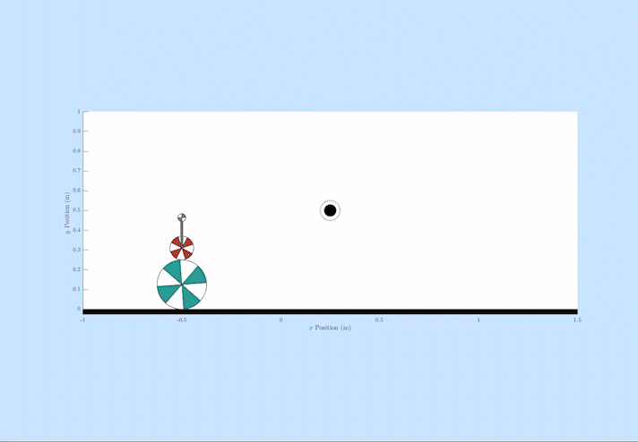

# About Me

    

        
I am a Ph.D. candidate in the Robotics Department at the University of Michigan. My research focuses on developing control algorithms for robotic knee-ankle prostheses and how different controllers affect user outcomes. In general, I am interested in dynamics, control, robotic systems, optimization, real-time software design, and human motor control. 

    

    

        
    

# Projects
This website lists some of the projects that I have worked on during my time in grad school. These are a mix of course and research projects: 
- [Data-Driven Impedance Controllers for Knee-Ankle Prostheses](#data-driven-impedance-control-for-knee-ankle-prostheses)
- [Software and Control Development for the Open-Source Leg](#the-open-source-leg-osl)
- [Tech Commercialization with Össur](#technology-commercialization-in-partnership-with-össur)
- [Convex MPC for A Ballbot](#control-of-a-planar-ballbot-with-obstacle-avoidance)
- [Contact-Implicit DDP for Legged Robots](#data-driven-impedance-control-for-knee-ankle-prostheses)

For my full list of publications, please reference my [Google Scholar](https://scholar.google.com/citations?user=P5lqq8YAAAAJ&hl=en). 

## Core Research
### Data-Driven Impedance Control For Knee-Ankle Prostheses
The prevailing paradigm in lower-limb robotic prosthesis control is to use hand-designed controllers with heuristically tuned behaviors. While these approaches can be very effective, they are labor-intensive in both the design of the behaviors and in individualizing them to each individual at the point-of-care. In this work, we instead developed a data-driven control architecture that allowed the prosthesis to work over continuums of tasks without requiring manual tuning. 

Learn more about our work in this video:

The main publication detailing this work can be found [here in the IEEE Transactions on Robotics](https://ieeexplore.ieee.org/document/10017125). We've also extended this approach to [sit/stand](https://ieeexplore.ieee.org/document/10268252) and [stair traversal](https://ieeexplore.ieee.org/document/10302427).

During the development of the controller, we also created a treadmill-based simulation of a local hiking trail to highlight the incline-adaptability of our controller. Here is the video:

### The Open-Source Leg (OSL)

The Open-Source Leg project aims to accelerate research in the field of lower-limb robotic prostheses by providing a common research platform to the field. [Senthur Ayyappan](https://senthurayyappan.github.io/), a rockstar mechanical designer and software engineer, currently maintains and leads the project along with PI Elliott Rouse at the University of Michigan. Full CAD design files, software libraries, and other resources are available to the public to use free of charge.  See [www.opensourceleg.org](https://www.opensourceleg.org/) for more information. 

In addition to helping Senthur with the [OSL library development](https://github.com/neurobionics/opensourceleg), I've worked on creating controllers for the OSL. [This paper](https://ieeexplore.ieee.org/document/10807510) details a control approach I developed that accounts for some of the inherent drivetrain dynamics of the OSL, allowing it to perform accurate impedance control. 
We've also released the Data-Driven Impedance Controller discussed above for public download from the [OSL Website](https://www.opensourceleg.org/control/research) so that other researchers can use it, benchmark against it, and build upon it. 

### Technology Commercialization in Partnership with Össur
We have worked with [Össur](https://www.ossur.com/en-us), one of the leading manufacturers in prosthesis technology, to test our control algorithms on their commercial hardware. The video below shows our data-driven variable impedance controller deployed on the Össur Power Knee. A key feature of our controller is its phase variable that synchronizes the leg's behavior to the user's intent. This allows Andrew to volitionally control the leg and kick the ball: 

## Academic Class Projects
These are class projects that are outside my core research area that I created during grad school. 

### Control of a Planar Ballbot with Obstacle Avoidance

This project was developed for an Applied Optimal Control course taught by Dr. Christian Hubicki in the Winter 2023 semester. I wrote a controller for a ballbot, which is a small, wheeled robot that balances on top of a basketball. The controller uses trajectory optimization and convex model predictive control (MPC) to navigate the world while staying balanced and avoiding obstacles. 

A repo containing more information and the control code is [available here](https://github.com/tkevinbest/Ballbot).

### Contact-Implicit Differential Dynamic Programming

This project was developed for my Legged Robots course at the University of Michigan taught by Prof. Yanran Ding in the Winter 2024 semester. This work mainly follows the publication from Kim et al. "Contact-Implicit Differential Dynamic Programming for Model Predictive Control with Relaxed Complementarity Constraints", IROS 2022.

Online contact planning is a desirable feature in
a legged-robot control system, as it allows the controller more
freedom in planning motions to navigate various terrains. However, the numerical consequences of including decisions regarding
contact in optimal control problems often make them difficult to
solve and prohibitively slow for real-time use. In this work, I implement the contact-implicit differential dynamic programming-based model predictive controller first presented by Kim et al. in 2022, which,
through clever relaxations of the ground contact complementarity
constraints, can select appropriate contact modes at rates suitable
for online use. 

From very sparse and simple reference trajectories, the controller can identify appropriate contact sequences and gaits automatically. In the following videos, the contact sequences are not prespecified. Rather, they are automatically generated by the algorithm in real-time. 

_Vertical Hopper:_ By commanding a constant reference position above the ground, the algorithm selects a hopping gait to get as close to the reference as possible. 

_Forward Hopper:_ Likewise if we command a simple horizontal velocity reference, the algorithm can automatically identify this hopping gait forward. 

The full report detailing this controller and the mathematical underpinnings can be [found here](/assets/contact-implicit-ddp-report.pdf). Unfortunately, the base repository for my code is not public. If you are interested in seeing it, please email me and I can request that you are given access. 
